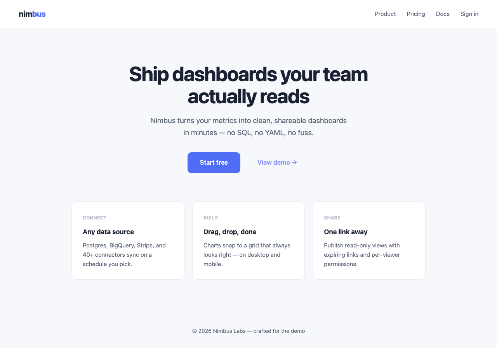

# looksy

[](https://github.com/atre/looksy/actions/workflows/ci.yml)
[](LICENSE)

Screenshot any URL from the command line. Built for AI-assisted development — lets Claude Code (or any AI) **see** rendered pages and iterate on designs visually.

**Zero config. One command. Works with any framework.**

```bash
looksy https://mysite.com --design    # Full-page screenshot + compact metadata
```

<p align="center"></p>

What the AI gets back alongside the pixels — exact values, not guesses:

```text
Page: 1280x896px "Nimbus — Ship dashboards faster" (1.5s)
contrast: 5 AA fail, 13 AAA fail (19 checked)

## Suggestions
1. [HIGH] contrast: `.cta` — darken bg to `#4d6aef` for 4.5:1 (currently 4.3:1, need 4.5:1)
2. [HIGH] contrast: `.badge` — darken text to `#72767e` for 4.5:1 (currently 1.9:1, need 4.5:1)
```

## Features

- **Screenshot any URL** — local files (auto-served), dev servers, deployed sites
- **AI-optimized output** — metadata sidecar with exact CSS values, not just pixels
- **Visual regression** — baseline save/diff with pixel-level change detection
- **Diff→element attribution** — diffs report *which elements* changed and *which CSS values* (`.hero-cta — padding: 16px → 12px`), not just a pixel percentage
- **Ignore masks** — `--ignore ".ad,.timestamp"` masks dynamic regions so regression gates don't cry wolf
- **Stable captures by default** — waits for web fonts, pauses animations/transitions before every shot (`--no-stabilize` to opt out)
- **Playwright MCP interop** — `--cdp` attaches to an existing agent-driven browser session; auth/cookies carry over
- **Consent banners out of the shot** — `--dismiss-consent` clicks the CMP accept button (OneTrust, Cookiebot, Sourcepoint/Quantcast iframes, Usercentrics, Didomi, CookieYes, consentmanager, …) or hides the overlay; `--cookie` / `--local-storage` seed the site's own consent state before load
- **Accessibility audits** — WCAG contrast, landmarks, heading structure, missing labels
- **Anti-fingerprint audits** — class audit (with recurring class combos), font sources, asset hashes, SEO, JSON-LD schema
- **Structural fingerprinting** — cross-site similarity scoring with `fingerprint collect/compare` (8 dimensions including inline script hashes)
- **Tailwind utility profile** — `--tailwind` groups class names by category (spacing, sizing, colors, layout, typography, borders, animation)
- **Component-level contrast** — React fiber walk maps WCAG failures back to `file:line` source location
- **Theme validation** — WCAG AA/AAA checks for theme color configs, no browser needed
- **Batch mode** — screenshot multiple pages or directory trees in one command
- **Design suggestions** — actionable fix recommendations with exact CSS values for contrast, a11y, SEO
- **Layout debugging** — flex/grid container overlay with numbered labels
- **Responsive audit** — overflow, touch targets, text size checks at 3 breakpoints
- **Visual regression gate** — one-command `guard` subcommand for CI/CD
- **Delta tracking** — incremental diffs showing only what changed (~80 tokens)
- **Design spec validation** — validate pages against a JSON specification
- **Component catalog** — multi-selector element capture with grid composite
- **Capture history** — timestamped timeline of all captures per URL
- **Performance analysis** — bundle analysis, image audit, compression, third-party impact, cache audit, critical path, resource hints, server timing
- **Performance budgets** — CI/CD gate with `--budget` (exit code 1 on failure)
- **One-command perf audit** — `--speed` runs all performance modules in one flag
- **Token-efficient** — three tiers: full meta (~2,500 tokens), compact (~1,000), text-only (~100)
- **CI/CD ready** — `--fail-on-aa` (with failure details to stderr), `--budget`, `--json` output, exit codes
- **Fast** — persistent Chromium server cuts captures from ~2s to ~100ms
- **Security hardened** — CSS selector injection prevention, path traversal guard, TOCTOU race elimination, restrictive `/tmp` permissions
- **Strict flag parsing** — typos like `--contrast-aa` error immediately instead of being silently ignored
- **Configurable storage** — `LOOKSY_DIR` env var for persistent baselines in CI (default: `/tmp/looksy`)
- **MCP integration** — runs as a tool server for Claude Code

## Install

Install straight from GitHub (not yet published to npm):

```bash
npm install -g github:atre/looksy        # latest main
npm install -g github:atre/looksy#v0.1.0 # pinned release (recommended for CI)
```

Claude Code skill (`/visual-qa`, auto-triggers on UI review): `ln -s "$(pwd)/skills/visual-qa" ~/.claude/skills/visual-qa` from a source checkout — `skills/visual-qa/SKILL.md` is the canonical copy.

Or from source:

```bash
git clone https://github.com/atre/looksy.git
cd looksy
npm install
npm run build
npm link
```

Looksy auto-installs Playwright Chromium on first install. If it doesn't, run:

```bash
npx playwright install chromium
```

**Requires Node.js 18.3+.**

### PATH (mise / non-interactive shells)

`npm link` (or a global install) only lands `looksy` on `PATH` for shells that source your
normal shell rc. Non-interactive shells — CI steps, cron, an agent's own tool-call shell —
often skip that, especially with a version manager like [mise](https://mise.jdx.dev/) managing
`node`: the shim directory isn't on `PATH` until mise has hooked the shell, which a
non-interactive shell frequently hasn't done. Symptom: `looksy: command not found` even though
`npm link` reported success.

Fixes, in order of preference:

```bash
# 1. Point at the linked global bin explicitly (works regardless of shell/mise state)
#    (npm bin -g was removed in npm 9 — use npm prefix instead)
"$(npm prefix -g)/bin/looksy" <url>

# 2. With mise, activate its shims for the current shell
mise activate bash   # or: mise activate zsh
looksy <url>

# 3. Fallback that always works — run the built CLI entry point directly with node,
#    no PATH resolution involved at all:
node /path/to/looksy/dist/cli.js <url>
```

Option 3 is the most portable one for scripts/CI: it has no dependency on `PATH`, `npm link`,
or a version manager being initialized — only that `dist/` has been built (`npm run build`).

If `looksy` was on `PATH` yesterday and isn't today (node upgrade, mise switching versions,
`npm prefix -g` moving), re-run `npm link` from the checkout — the symlink lives under the
*current* global prefix, so a new Node major means a new empty prefix.

## Quick Start

```bash
# Start persistent browser (optional but recommended — ~100ms vs ~2s per capture)
looksy --serve

# Screenshot with metadata
looksy http://localhost:3000 --design

# Check accessibility
looksy http://localhost:3000 --check "contrast:aa"

# Batch audit multiple pages
looksy http://localhost:3000 --pages "/,/pricing,/about" --contrast --fail-on-aa

# Batch audit build output directory
looksy batch test-builds/ --glob "*/index.html" --report --contrast

# Fleet audit across live domains (defaults to contrast + a11y, exit 1 on AA failure)
looksy fleet https://site-a.com https://site-b.com

# Or drive it from ./fleet.yaml (no URLs given → reads the config instead)
looksy fleet --design-audit

# Structural fingerprint (cross-site similarity detection)
looksy fingerprint collect https://site-a.com --save site-a
looksy fingerprint collect https://site-b.com --save site-b
looksy fingerprint compare site-a site-b
looksy fingerprint diff site-a-v1 site-a-v2          # What changed between versions
looksy fingerprint collect-batch --serve-dir ./builds --glob "*/index.html"  # Batch
looksy fingerprint list

# Theme validation (no browser needed)
looksy validate-theme theme.json
looksy validate-theme theme.json --compact --fail-on-aa
```

## Workflows

### Design iteration (most common)

```bash
looksy --serve                                    # Start once per session
looksy <url> --design --name step1                # Full-page + compact metadata, labeled
looksy <url> --check "contrast:aa"                # WCAG AA pass/fail with failing element details
looksy <url> --diff-inline /tmp/looksy/preview-step1.png --name step2  # Before/after
```

### Batch site audit

```bash
looksy fleet https://a.com https://b.com --design -q      # N URLs → per-URL summaries + closing table
looksy <url> --pages "/,/pricing,/about" --full           # Screenshot multiple pages
looksy <url> --pages "/,/pricing" --design --concurrency 2  # Heavy analysis with limited parallelism
looksy <url> --pages "/,/pricing" --contrast --fail-on-aa # Contrast check all pages (details to stderr)
looksy <url> --pages "/,/pricing" --consistency           # Flag cross-page divergences
looksy <url> --pages "/,/pricing" --locales "en,de"       # Cross-product: 4 pages
```

### fleet.yaml — run the whole fleet from one config

`looksy fleet` with no URLs (no positionals, `--urls`, `--url-file`) reads `./fleet.yaml` in the
current directory (override the location with `--fleet <path>`). Same schema as peep/texter/trusty,
so one file drives the whole post-deploy set instead of 4×N invocations:

```yaml
domains: [a.com, b.com]
pages: [/, /about, /pricing]
locales: [en, de]          # parsed, ignored by looksy — pages already carry locale prefixes
viewports: [mobile]        # [mobile] → --mobile, [mobile, desktop] → --multi, [desktop]/omitted → default
```

```bash
looksy fleet --design-audit           # domains x pages from ./fleet.yaml, mobile-aware per viewports:
looksy fleet --fleet ./prod.yaml -q   # explicit config path
looksy fleet https://c.com            # any explicit URL/--urls/--url-file skips fleet.yaml entirely
```

### Batch directory audit

```bash
looksy batch test-builds/ --glob "*/index.html" --report --contrast  # All matching files
looksy --serve-dir ./build --pages "/,/about" --report               # Serve dir + pages
looksy ./build/index.html --report                                   # Auto-serve local file
```

### Structural fingerprinting

```bash
looksy fingerprint collect https://site-a.com --save site-a   # Collect DOM fingerprint
looksy fingerprint collect https://site-b.com --save site-b   # Collect another
looksy fingerprint collect --serve-dir ./build --save my-site  # Fingerprint a static build
looksy fingerprint collect-batch --serve-dir ./dist --glob "*/index.html"  # Batch collect
looksy fingerprint compare site-a site-b                       # 0-100 similarity score
looksy fingerprint diff v1 v2                                  # Show what changed between versions
looksy fingerprint list                                        # List saved fingerprints
```

### Theme validation

```bash
looksy validate-theme theme.json                  # WCAG AA/AAA check for all color pairs
looksy validate-theme globals.css                 # :root or Tailwind v4 @theme --color-* vars, auto-paired
looksy validate-theme globals.css --text-on foreground,muted-foreground --bg-tokens background,muted,card
                                                  # cross-product: each text token on each surface
looksy validate-theme theme.json --compact        # Condensed output
looksy validate-theme theme.json --fail-on-aa     # Exit code 1 on AA failures (CI/CD)
```

No browser needed — validates color contrast ratios directly from a theme config file.

### Visual regression

```bash
looksy save <url> homepage                        # Save baseline
# ... make changes ...
looksy diff <url> homepage                        # Pixel diff → /tmp/looksy/diff.png
looksy diff before.png after.png                  # Or compare two local files
```

### Visual regression gate (CI/CD)

```bash
looksy guard homepage https://staging.example.com           # Auto-creates baseline on first run
looksy guard homepage https://staging.example.com           # Compares on subsequent runs
looksy guard homepage https://staging.example.com --threshold 1.0  # Custom threshold
```

One command that auto-creates baselines, diffs on subsequent runs, and exits with code 1 if changes exceed the threshold.

### Watch mode with auto-serve

```bash
looksy --watch ./src                              # Auto-serves ./src, re-screenshots on change
looksy <url> --watch ./src                        # Watch with explicit URL
```

When no URL is given, `--watch` auto-serves the watched directory via HTTP.

### Performance audit

```bash
looksy <url> --speed                              # Full perf audit (all modules, one command)
looksy <url> --bundles --images --compression      # Individual modules
looksy <url> --critical-path --server-timing       # Render-blocking + TTFB breakdown
looksy <url> --third-party --cache-audit           # Third-party impact + caching
looksy <url> --resource-hints                      # Preload/preconnect suggestions
looksy <url> --budget "totalJS:200KB,FCP:1800"     # CI gate (exit 1 on failure)
looksy <url> --budget budget.json                  # Budget from JSON file
```

### Cheap verification loop

```bash
looksy <url> --report                             # Text-only (~100 tokens, no screenshot)
looksy <url> --check "sticky header, contrast:aa" # Pass/fail assertions (~50 tokens)

# Want the PNG too, e.g. to eyeball it later? Add -o/--name/--suffix — an explicit
# output path is honored even in --report's normally screenshot-free text-only mode.
looksy <url> --report --name cart                 # Text summary AND preview-cart.png
```

## Usage

<details>
<summary><strong>Full flag reference</strong> — every capture, analysis, batch, and auth flag with examples (click to expand)</summary>

```bash
# Basic screenshot
looksy <url>                                    # Screenshot to /tmp/looksy/preview.png
looksy ./mock.html                              # Screenshot a local file (auto-served via HTTP)
looksy <url> --meta                             # + metadata sidecar (.meta.md)
looksy <url> --annotate --meta                  # + numbered bounding boxes on elements
looksy <url> --perf --meta                      # + Core Web Vitals (FCP, LCP, CLS, TTFB)
looksy <url> -o ./screenshot.png                # Custom output path

# Viewports
looksy <url> --mobile                           # Mobile viewport (390x844)
looksy <url> --tablet                           # Tablet viewport (768x1024)
looksy <url> --multi                            # Desktop + mobile in one shot (parallel)
looksy <url> --width 1440 --height 900          # Custom viewport

# Output naming
looksy <url> --suffix hero                      # Output: preview-hero.png
looksy <url> --name hero                        # Same as --suffix (alias)

# Capture options
looksy <url> --full                             # Full page scroll capture
looksy <url> --full --max-height 2000           # Full page capped at 2000px
looksy <url> --selector ".hero-section"         # Screenshot specific element
looksy <url> --wait 2000                        # Wait ms before screenshot
looksy <url> --dark                             # Emulate prefers-color-scheme: dark
looksy <url> --design                           # Shorthand for --full --meta --compact --fonts --css-vars --contrast --suggest
looksy <url> --fold                             # Above-fold only (viewport height)
looksy <url> --micro                            # Thumbnail mode (640px, JPEG q40)
looksy <url> --selector ".card" --all           # Screenshot every matching element
looksy <url> --design-spec ./spec.json          # Validate against design spec
looksy <url> --diff-report baseline-name        # Semantic diff vs saved baseline
looksy <url> --format jpeg --quality 80         # JPEG output (smaller files)

# Interact before capture
looksy <url> --interact "click:.btn,wait:500"   # Click, wait, then screenshot
looksy <url> --interact "scroll:800,wait:200"   # Scroll down, then screenshot
looksy <url> --interact "scroll-to:.footer"     # Scroll element into view
looksy <url> --interact "type:.search=hello"    # Type into input, then screenshot
looksy <url> --interact "hover:.menu"           # Hover element, then screenshot

# CSS injection (test visual changes without editing files)
looksy <url> --inject "body { background: red }" # Inject CSS before capture
looksy <url> --ignore ".ad, .timestamp"         # Mask dynamic regions (stable diffs/baselines)
looksy <url> --no-stabilize                     # Skip fonts.ready wait + animation pause

# Navigation timeout
looksy <url> --timeout 60000                    # Custom timeout (default: 30000ms)

# Force a hostname to a specific IP (stale local DNS after a fresh domain cutover)
looksy <url> --host-resolver staging.example.com:203.0.113.5

# HTML pipe (no file needed)
echo '<div>hello</div>' | looksy --html         # Screenshot piped HTML snippet

# Side-by-side before/after diff
looksy <url> --diff-inline before.png           # Compare current vs "before" PNG

# Visual regression (baseline diff)
looksy save <url> <name>                        # Save screenshot as named baseline
looksy diff <url> <name>                        # Compare vs baseline → diff.png + changed
                                                # elements w/ CSS deltas (.cta — padding: 16px → 12px)
looksy diff <url> <name> --ignore ".ad"         # Mask dynamic regions on both sides
looksy diff before.png after.png                # Compare two local image files → diff.png
looksy list                                     # List saved baselines

# Batch directory mode
looksy batch <dir> --glob "*/index.html"        # Batch screenshot matching files (auto-served)
looksy batch <dir> --glob "**/*.html" --report  # With analysis
looksy --serve-dir ./build --pages "/,/about"   # Serve directory + batch pages

# Watch mode
looksy <url> --watch ./src                      # Re-screenshot when files change (with diff %)
looksy --watch ./src                            # Auto-serves ./src, re-screenshots on change

# Analysis (appended to .meta.md)
looksy <url> --a11y                             # Accessibility audit
looksy <url> --contrast                         # WCAG color contrast check (semantic grouping)
looksy <url> --contrast --fail-on-aa            # Exit code 1 + failure details to stderr
looksy <url> --contrast --fail-on-aaa           # Exit code 1 + failure details to stderr
looksy <url> --contrast --visible-only          # Skip hidden elements (dropdowns, modals)
looksy <url> --network                          # Network waterfall
looksy <url> --css-vars                         # CSS custom properties from :root
looksy <url> --fonts                            # Font loading verification
looksy <url> --lighthouse                       # Extended perf (memory, long tasks, INP)
looksy <url> --dom-stats                        # DOM complexity one-liner
looksy <url> --links                            # Dead link checker (HEAD all hrefs)
looksy <url> --links --links-allow "x.com,li.com" # hosts to bucket `unverifiable` (bot-blockers) instead of dead
looksy <url> --coverage --meta                  # CSS/JS code coverage
looksy <url> --class-audit                      # Extract all CSS class names + recurring class combos
looksy <url> --tailwind                         # Tailwind utility profile (groups by category, implies --meta)
looksy <url> --font-sources                     # List all font file URLs and CDN domains
looksy <url> --asset-hashes                     # List hashed asset filenames (build fingerprints)
looksy <url> --seo                              # SEO audit (robots.txt, sitemap, og, canonical)
looksy <url> --schema                           # JSON-LD structured data extraction + validation

# Advanced capture
looksy <url> --sweep                            # 5 responsive breakpoints (parallel)
looksy <url> --sweep --sweep-widths 375,768     # Custom breakpoint widths
looksy <url> --sweep --check "contrast:aa"      # Check contrast at all breakpoints
looksy <url> --sections                         # Screenshot each section individually
looksy <url> --filmstrip 2000                   # 8-frame filmstrip over 2s
looksy <url> --filmstrip 2000 --filmstrip-scroll 1200  # Scroll 1200px across the filmstrip
looksy <url> --compare https://other.com        # Visual diff between two URLs
looksy <url> --compare https://other.com --class-audit  # + CSS class fingerprint overlap
looksy <url> --pdf                              # Export as PDF
looksy <url> --record 3000                      # Record 3s video (WebM)
looksy <url> --har                              # Export HTTP Archive (.har)

# Token-saving
looksy <url> --compact --meta                   # Condensed metadata (~50-60% fewer tokens)
looksy <url> --report                           # Text-only summary (~100 tokens, no screenshot)
looksy <url> --check "sticky header, dark bg"   # Pass/fail checklist (no screenshot)
looksy <url> --check "contrast:aa"              # WCAG AA pass/fail with failing elements
looksy <url> --check "text:Hello, selector:h1"  # Extended check grammar
looksy <url> --check "count:3 .card"            # Exact element count
looksy <url> --check "dark bg:.hero"            # Scoped background luminance check
looksy <url> --check "no generator"             # Verify no <meta name="generator"> tag
looksy <url> --check "translated"               # Flag untranslated text on non-English pages
looksy <url> --audit "border-primary/10"        # Flag deprecated design token usage
looksy <url> --meta --perf --json               # Machine-parseable JSON output

# Performance analysis
looksy <url> --speed                            # Full perf audit (all modules + report)
looksy <url> --bundles                          # JS bundle analysis (chunks, categories)
looksy <url> --images                           # Image audit (oversized, lazy/eager, format)
looksy <url> --image-optimizer                  # Does the CDN/optimizer resize? re-fetch w=64 vs w=1080, flag PASS-THROUGH
looksy <url> --compression                      # Compression check (gzip/brotli/none)
looksy <url> --third-party                      # Third-party resource impact by origin
looksy <url> --cache-audit                      # Cache policy audit
looksy <url> --critical-path                    # Critical rendering path analysis
looksy <url> --resource-hints                   # Resource hints audit (preload/preconnect)
looksy <url> --server-timing                    # Server timing + TTFB breakdown
looksy <url> --budget "totalJS:200KB,FCP:1800"  # Performance budget gate (CI/CD)
looksy <url> --budget budget.json               # Budget from JSON file

# New analysis & capture modes
looksy <url> --delta                            # Incremental diff vs previous (~80 tokens)
looksy <url> --suggest                          # Actionable fix recommendations
looksy <url> --layout --meta                    # Flex/grid overlay + legend
looksy <url> --responsive-check                 # Responsive audit (3 breakpoints)
looksy <url> --responsive-check --target-size 24  # AA touch-target threshold (default 44 = AAA)
looksy <url> --components ".hero,.cta"          # Screenshot elements + grid composite
looksy <url> --history                          # Save to timestamped timeline
looksy guard <name> <url>                       # Visual regression gate (auto-baseline)
looksy guard <name> <url> --threshold 1.0       # Custom pixel change threshold
looksy history                                  # Show capture history timeline

# Batch mode
looksy <url> --pages "/,/pricing,/contact"      # Screenshot multiple pages in one command
looksy <url> --pages "/,/pricing" --concurrency 3  # Limit parallel captures (default: 3 with --design)
looksy <url> --pages "/,/pricing" --output-dir ./shots  # Output to directory
looksy <url> --pages "/,/pricing" --locales "en,de"  # Cross-product: 4 pages
looksy <url> --pages "/,/pricing" --consistency  # Flag cross-page divergences
looksy <url> --pages "/,/pricing" --contrast    # Consolidated contrast summary
looksy <url> --i18n-check "/en/pricing,/de/pricing"  # Structural comparison of locale pages
looksy --urls "https://a.com,https://b.com" --batch-report  # Multi-domain batch
looksy --url-file sites.txt --contrast          # URLs from a file (one per line, # comments)
looksy fleet https://a.com https://b.com        # Fleet audit (contrast+a11y, batch-report.md)
looksy --cat-meta                               # Print last meta file to stdout

# Structural fingerprint (cross-site similarity)
looksy fingerprint collect <url> --save <name>   # Collect DOM fingerprint from URL
looksy fingerprint collect --serve-dir <dir> --save <name>  # Fingerprint a static build
looksy fingerprint collect-batch --serve-dir <dir> [--glob "*/index.html"]  # Batch collect
looksy fingerprint compare <name1> <name2>       # 0-100 similarity score (or N names for matrix)
looksy fingerprint diff <before> <after>         # Show what changed between two versions
looksy fingerprint list                          # List saved fingerprints

# Theme validation (no browser needed)
looksy validate-theme theme.json                # WCAG AA/AAA check for all color pairs
looksy validate-theme theme.json --compact --fail-on-aa  # CI/CD gate

# Auth & consent banners
looksy <url> --cookie "session=abc123"          # Set cookies before capture
looksy <url> --local-storage "cmp_consent=1"    # Seed localStorage before any page script runs
looksy <url> --dismiss-consent                  # Click the CMP accept button (OneTrust, Cookiebot, Sourcepoint,
                                                # Usercentrics, Didomi, CookieYes, …) or hide the overlay
looksy <url> --storage-state ./auth.json        # Playwright storage state file
looksy <url> --basic-auth user:password         # HTTP basic auth

# Output shaping
looksy <url> --design -q                        # --quiet: no path lines, just Page + summaries
looksy <url> --speed --limit 25                 # list up to 25 offenders per section
looksy fleet --brief                            # red-only ≤10 lines: `✗ <url> — HTTP 404, hscroll +21px, 2 AA fail`
                                                # or `✓ N URLs clean`; implies -q; any ✗ line → exit 1
looksy fleet https://a.com https://b.com -o out/  # -o dir/ (trailing slash or existing dir): one preview-<slug>.png
                                                # + sidecar per URL, batch-report.md inside; -o file.png = last URL wins

# Speed
looksy --serve                                  # Start persistent Chromium (~100ms captures)
looksy <url>                                    # Uses running server automatically
looksy --serve-stop                             # Stop server
looksy <url> --cdp http://localhost:9222        # Attach to an existing browser over CDP
                                                # (e.g. a Playwright MCP session — auth carries over)

# MCP integration
looksy --mcp                                    # Run as MCP tool server for Claude Code

# Utility
looksy --version                                # Print version number
LOOKSY_DIR=./baselines looksy <url>             # Custom base directory (CI persistent baselines)
```

</details>

## Output

Screenshots save to `/tmp/looksy/preview.png` by default (overwritten each time). Set `LOOKSY_DIR` env var to change the base directory (e.g., `LOOKSY_DIR=./baselines` for persistent CI storage). Every invocation prints page dimensions and timing:

```
Page: 1280x4200px "My Site" (1.2s)
```

### Metadata sidecar (`--meta`)

Writes `.meta.md` alongside the PNG with:

- Heading hierarchy (H1-H6 tree)
- Color palette (computed RGB values)
- Font stack
- Console errors and broken images
- Key element computed styles (font-size, padding, margin, colors, display, gap, dimensions)
- Above/below fold tagging
- Image optimization hints (natural vs display dimensions)

### Analysis flags

| Flag | What it does | Tokens |
|------|-------------|--------|
| `--design` | Shorthand for `--full --meta --compact --fonts --css-vars --contrast --suggest` | ~1,000 |
| `--meta` | Full metadata sidecar | ~2,500 |
| `--compact` | Condensed metadata (no tables, shorthand CSS) | ~1,000 |
| `--report` | Text-only summary, no screenshot | ~100 |
| `--check "<assertions>"` | Pass/fail checklist, no screenshot | ~50 |
| `--annotate` | Numbered bounding boxes on elements | — |
| `--perf` | Core Web Vitals (FCP, LCP, CLS, TTFB) | — |
| `--a11y` | Accessibility audit (landmarks, headings, issues) | — |
| `--contrast` | WCAG AA/AAA contrast ratios with semantic grouping (+ React `file:line` source when available) | — |
| `--contrast-limit <n>` | Max elements sampled by contrast checks (default 150; reports coverage when capped) | — |
| `--limit <n\|all>` | Max offenders listed per section — touch targets, uncompressed, no-cache, large bundles, image issues (default 10; 5 in compact lists) | — |
| `--network` | Network waterfall (top 15 slowest resources) | — |
| `--css-vars` | CSS custom properties from `:root` | — |
| `--fonts` | Font loading verification | — |
| `--lighthouse` | Extended perf (memory, long tasks, INP) | — |
| `--dom-stats` | DOM complexity (elements, depth, inline styles) | — |
| `--links` | Dead link checker | — |
| `--coverage` | CSS/JS code coverage via CDP | — |
| `--class-audit` | All CSS class names + recurring class combos (component shape detection) | — |
| `--tailwind` | Tailwind utility profile by category (auto-implies `--meta`) | — |
| `--font-sources` | Font file URLs and CDN domains | — |
| `--asset-hashes` | Hashed asset filenames (build fingerprints) | — |
| `--seo` | SEO audit (robots.txt, sitemap, OG, canonical, schema) | — |
| `--schema` | JSON-LD structured data extraction + validation | — |
| `--design-spec <json>` | Validate page against a design spec (fonts, colors, spacing) | — |
| `--diff-report <name>` | Semantic diff against a saved baseline | — |
| `--suggest` | Actionable fix recommendations (contrast, a11y, SEO) | ~100 |
| `--delta` | Incremental diff vs previous capture (only what changed) | ~80 |
| `--layout` | Flex/grid container overlay with numbered labels | — |
| `--responsive-check` | Responsive audit at 3 breakpoints (overflow, touch, text) | — |
| `--target-size <n>` | Touch-target threshold for `--responsive-check` (default 44 = AAA, 24 = AA) | — |
| `--components <sels>` | Multi-selector element capture with grid composite | — |
| `--history` | Save capture to timestamped timeline | — |
| `guard <name> <url>` (or `--guard <name>`) | Visual regression gate (auto-baseline, threshold, CI exit codes) | — |
| `--audit "<pattern>"` | Design token audit | — |
| `--speed` | Compound: all 11 performance modules + `--report --compact` | — |
| `--bundles` | JS bundle analysis (chunks, categories, large bundles) | — |
| `--images` | Image audit (oversized, lazy/eager, format, dimensions) | — |
| `--compression` | Compression check (gzip/brotli/none per text resource) | — |
| `--third-party` | Third-party resource impact by origin (categorized) | — |
| `--cache-audit` | Cache policy audit (status, TTL, issues) | — |
| `--critical-path` | Critical rendering path (blocking resources, LCP, TTFB) | — |
| `--resource-hints` | Resource hints audit (preload/preconnect suggestions) | — |
| `--server-timing` | Server timing + TTFB breakdown (DNS/TCP/TLS/server) | — |
| `--budget <config>` | Performance budget gate (exit code 1 on failure) | — |
| `fingerprint collect/compare` | Structural fingerprint, 0-100 similarity score (8 dimensions incl. inline script hashes) | — |
| `fingerprint collect-batch` | Batch fingerprint collection from a directory | — |
| `fingerprint diff` | Show what changed between two fingerprint versions | — |
| `validate-theme` | WCAG AA/AAA contrast for theme color configs (no browser) | — |
| `--design-audit` | Pre-launch QA: `--design`'s sidecar (`--full --compact --meta --fonts --css-vars --contrast --suggest`) + `--seo --schema --font-sources --responsive-check` + `--check "no generator, self-hosted-fonts, contrast:aa"`; responsive findings print to stdout | — |
| `--batch-report` | With `--pages`/`--urls`: consolidated markdown table | — |
| `--urls "<a,b>"` / `--url-file <path>` | Multi-domain batch capture (shared browser, concurrency-limited) | — |
| `fleet <url...>` | Multi-URL audit: defaults to `--contrast --a11y --compact`, writes `batch-report.md`, exit 1 on AA failure | — |
| `fleet` (no URLs) / `--fleet <path>` | Reads `./fleet.yaml` (domains x pages, shared schema with peep/texter/trusty) instead of positionals | — |
| `--json` | Output `.meta.json` instead of `.meta.md` (`--batch-report`/`fleet` write both: `.meta.json` for CI, `.meta.md` for agents) | — |
| `-q, --quiet` | Suppress output-path lines and the `Tip: looksy --serve` hint; keep the `Page:` line, analyzer summaries, checks, suggestions | — |
| `--brief` | Implies `-q`; red-only ≤10-line summary for gates/hooks: `✗ <url> — HTTP 404, hscroll +21px, 2 AA fail, 1 check fail` per red URL, `✓ N URLs clean` otherwise; no `Batch report:`/warning noise | — |
| `--links-allow <hosts>` | With `--links`: comma-separated host suffixes bucketed `unverifiable` (bot-blockers) instead of dead | — |
| `--image-optimizer` | Re-fetch each `` at w=64 and w=1080 — same bytes → `PASS-THROUGH` (optimizer not resizing) | — |
| `-o <dir>/` | Batch (`fleet`/`--urls`/`--pages`): trailing slash or existing dir → one `preview-<slug>.png` + sidecar per URL and `batch-report.md` in that dir; `-o file.png` keeps last-URL-wins | — |
| `--cookie` / `--local-storage` / `--dismiss-consent` | Seed cookies / localStorage before load; click or hide consent banners (also applied to `--responsive-check` breakpoints) | — |
| `--inject <css>` | Inject custom CSS before capture | — |
| `--ignore <selectors>` | Mask dynamic regions before capture/diff (layout preserved) | — |
| `--no-stabilize` | Skip default capture stabilization (fonts.ready + animation pause) | — |
| `--cdp <endpoint>` | Attach to an existing browser over CDP instead of launching | — |
| `--timeout <ms>` | Navigation timeout (default: 30000ms) | — |
| `--host-resolver <domain:ip>` | Force one hostname to one IP for this run (stale local DNS) | — |
| `--concurrency <n>` | Max parallel page captures (default: 3 with `--design`/`--full`/`--speed`, unlimited otherwise) | — |
| `--output-dir <dir>` | Output directory for batch captures | — |
| `--foreground` | With `--serve`: block in this process instead of detaching | — |
| `--version` | Print version number and exit | — |

### `findings[]` (fleet contract)

Every `.meta.json` sidecar (`--json`, and always under `--batch-report`/`fleet`) carries a `findings`
array in the shape shared with pulse/snuff/brief — one finding per red signal, nothing for green:

```json
{
  "findings": [
    { "id": "visual:https://a.com/no-hscroll", "scope": "site", "severity": "crit",
      "title": "no-hscroll: +174px at 375px", "hint": "--sweep" },
    { "id": "visual:https://a.com/contrast", "scope": "site", "severity": "warn",
      "title": "contrast: 2 AA fail", "hint": "--design" }
  ]
}
```

- `id` — stable `visual:<url>/<check>` (URL without trailing slash); `scope` is always `site`
- `severity` — `crit` for a failed `--check` assertion, `warn` for audit-only red not covered by an
  explicit check (contrast AA fail, hscroll, touch-targets)
- `title` — `<check>: <short reason>` (or `<check> failed` when there is no detail); `hint` — the flag to dig in
- Fleet runs write one sidecar per URL (there is no fleet-level JSON object); concatenate the per-URL
  `findings` arrays yourself

### Check assertions

The `--check` flag supports these patterns:

| Pattern | Example | What it checks |
|---------|---------|---------------|
| `sticky header` | `--check "sticky header"` | Header position: sticky/fixed |
| `dark bg` / `light bg` | `--check "dark bg"` | Body background luminance |
| `dark bg:.sel` | `--check "dark bg:.hero"` | Scoped element luminance |
| `text:phrase` | `--check "text:Sign Up"` | Case-insensitive text search |
| `selector:.css` | `--check "selector:.hero"` | CSS selector presence |
| `count:N .sel` | `--check "count:3 .card"` | Exact element count |
| `contrast:aa` | `--check "contrast:aa"` | WCAG AA check with failing element details |
| `contrast:aaa` | `--check "contrast:aaa"` | WCAG AAA check with failing element details |
| `no generator` | `--check "no generator"` | Meta generator tag absence |
| `no X` | `--check "no border-primary"` | Absence check (class/style) |
| `has .sel` | `--check "has .nav"` | Presence check |
| `visible .sel` | `--check "visible .modal"` | Visibility check |
| `hidden .sel` | `--check "hidden .tooltip"` | Hidden check |
| `translated` | `--check "translated"` | Flag untranslated text on non-English pages |
| `font:<sel>=<family>` | `--check "font:h1=Archivo Black"` | Computed font-family check |
| `bg:<sel>=<hex>` | `--check "bg:.hero=#3D3D3D"` | Background color (±5 tolerance) |
| `color:<sel>=<hex>` | `--check "color:h1=#ffffff"` | Text color (±5 tolerance) |
| `self-hosted-fonts` | `--check "self-hosted-fonts"` | Fails if any external font domain found |
| `no-google-fonts` | `--check "no-google-fonts"` | GDPR: fails if Google Fonts detected |
| `unique-footer` | `--check "unique-footer"` | Footer presence (use with `--pages` for consistency) |
| `unique-nav` | `--check "unique-nav"` | Nav presence (use with `--pages` for consistency) |
| `class:<name>` | `--check "class:btn-primary"` | Some element has a class containing the name |
| `no-hscroll` | `--check "no-hscroll"` | Page is not wider than the viewport (no horizontal scroll) |
| `touch-targets[:N]` | `--check "touch-targets:24"` | No control smaller than N px (default 44); inline text links exempt |
| `h1-count[:N]` | `--check "h1-count"` | Exactly N `<h1>` (default 1); hidden headings ignored |
| `heading-outline` | `--check "heading-outline"` | No skipped heading levels; names both headings on failure |
| `no-broken-images` | `--check "no-broken-images"` | No `` failed to load (lazy not-yet-loaded ≠ broken) |
| `alt-text` | `--check "alt-text"` | Every `` has an `alt` attribute |
| `lang` / `canonical` / `meta-description` | `--check "lang, canonical"` | `<html lang>`, canonical link, meta description present |
| `og-image` / `og-title` / `og-tags` | `--check "og-tags"` | Open Graph image / title / title+description+image present |
| `twitter-card` | `--check "twitter-card"` | `<meta name="twitter:card">` present |

Unknown assertion names fail with `unknown assertion — known: …` (the full vocabulary) instead
of being silently coerced into a page-text search. `looksy --help` prints the same list.

### Batch mode

`--pages` screenshots multiple paths with a shared browser. Concurrency defaults to 3 when `--design`, `--full`, or `--speed` is active (prevents Chromium memory exhaustion). Override with `--concurrency N`.

```bash
looksy http://localhost:3000 --pages "/,/pricing,/contact"
# → preview-index.png, preview-pricing.png, preview-contact.png
```

Combine with `--locales` for cross-product expansion:

```bash
looksy http://localhost:3000 --pages "/,/pricing" --locales "en,de"
# → 4 pages: /en/, /en/pricing, /de/, /de/pricing
```

Use `--consistency` to flag divergences across pages (headings, colors, fonts, nav, footer). Use `--i18n-check` to compare two locale versions structurally.

### Batch directory mode

`looksy batch` screenshots files matching a glob pattern with auto-served HTTP:

```bash
looksy batch test-builds/ --glob "*/index.html" --report --contrast
# → preview-site-a.png, preview-site-b.png, ...
```

Each file's parent directory is auto-served via HTTP, so root-relative paths (`/_astro/`, `/_next/`) resolve correctly. No manual `python3 -m http.server` needed.

Use `--serve-dir` with `--pages` for explicit directory serving. Clean URLs are supported — `/about` resolves to `/about.html` for Astro `format:'file'` builds and similar static site generators:

```bash
looksy --serve-dir ./build --pages "/,/about,/pricing" --report   # Clean URLs work
looksy --serve-dir ./build --pages "/index.html,/about.html" --report  # Explicit paths too
```

`--serve-dir` also works with `fingerprint collect`:

```bash
looksy fingerprint collect --serve-dir ./build --save my-site
looksy fingerprint collect-batch --serve-dir ./dist --glob "*/index.html"
```

Local file paths are also auto-served: `looksy ./build/index.html` serves the directory via HTTP instead of using `file://`.

### Persistent server

`looksy --serve` starts a background Chromium server and **detaches**: it prints the pid and
WS endpoint, then returns control to your shell/script — the browser keeps running after the
command exits. All subsequent looksy invocations connect via WebSocket for ~100ms captures
instead of ~2s cold starts. Idempotent — calling it again while a server is already running
just prints its status and exits 0, it doesn't start a second one.

```bash
looksy --serve          # Start, detached (prints "server started (pid N)" + ws endpoint), returns immediately
looksy --serve          # Already running → prints "server already running (pid N)", exits 0
looksy <url>            # Uses server automatically
looksy --serve-stop     # Stop
```

Need the old blocking behavior (e.g. to supervise it yourself under systemd/pm2, or just
`&` it manually) — `looksy --serve --foreground` runs `chromium.launchServer` in the
current process and never returns until it's killed (Ctrl+C / SIGTERM).

> Before this, plain `--serve` blocked the calling process forever — fine interactively (you
> just `Ctrl+C` or background it with `&`), but it silently hung any script or CI step that
> called it expecting a normal command that returns. `--serve` now does the backgrounding
> itself; `--foreground` is there for when you specifically want the old behavior.

### MCP server

`looksy --mcp` runs as an MCP tool server over stdio. Register it in Claude Code:

```bash
claude mcp add looksy -- looksy --mcp
```

(or any MCP client that speaks stdio — Cursor, custom orchestrators, etc.)

**13 tools:** `screenshot`, `save-baseline`, `diff-baseline`, `list-baselines`, `diff-report`, `validate-contrast`, `validate-theme`, `validate-design`, `extract-colors`, `check-fonts`, `fingerprint-collect`, `fingerprint-compare`, `fingerprint-list`.

Judgment tools (contrast, theme, design, diff, fingerprint) return a structured JSON verdict alongside the human-readable text — `{ pass, score, summary, issues: [{ severity, message, selector?, fix? }] }` — so clients can branch on results programmatically instead of parsing prose.

## How It Works

AI coding assistants can read images but **can't judge spacing, subtle colors, or pixel alignment** from screenshots alone. The `--meta` sidecar fixes this by providing exact computed CSS values alongside the visual.

**The iteration loop:**

1. Edit your template/component
2. `looksy <url> --design` — full-page screenshot + compact metadata
3. AI reads the PNG (layout, structure) + `.meta.md` (exact font-size, padding, colors, gap)
4. AI fixes code with precise data, not guesswork
5. Repeat

**Real-world result:** 4 iterations from blank to production-ready dark-mode landing page. ~15,800 tokens total (~4-5% of a conversation). With `--compact`: ~10,000 tokens (~2-3%). With `--report` + `--check`: ~2,000 tokens (~0.5%).

## CI/CD Integration

```bash
# Fail build on WCAG AA contrast violations (failure details to stderr)
looksy https://staging.example.com --contrast --fail-on-aa

# JSON output for assertion scripts
looksy https://staging.example.com --meta --contrast --json
cat /tmp/looksy/preview.meta.json | jq '.contrast.aaFailures'

# Batch check all pages
looksy https://staging.example.com --pages "/,/pricing,/about" --check "contrast:aa"

# Batch check build output directory
looksy batch test-builds/ --glob "*/index.html" --contrast --fail-on-aa

# Performance budget gate
looksy https://staging.example.com --perf --bundles --budget "totalJS:200KB,FCP:1800"
```

Exit codes: `0` on success, `1` on failure, `--fail-on-aa`/`--fail-on-aaa` violations, `--budget` exceeded, or unknown flags (strict parsing).

## Development

```bash
npm install
npm run build           # tsc → dist/
npm run dev             # tsc --watch
npm test                # Build + run all tests
npx vitest run          # Run tests only (skip build)
npx vitest              # Watch mode
```

### Tests

442 tests across 49 test files:

- **Unit tests** (`tests/unit/`) — 422 tests, no browser. Each test file mirrors a source module (e.g., `cli.test.ts`, `contrast.test.ts`, `budget.test.ts`). Covers: CLI parsing, interactions, metadata formatting, theme validation, fingerprinting (incl. inline script hashes + asset filenames), check assertions, static server, delta/diff-report, batch-report, design-audit, class-audit (incl. recurring combo detection), and 3-5 tests each for ~20 formatter modules (bundles, images, compression, cache-audit, etc.).
- **Integration tests** (`tests/integration/`) — 20 tests across 3 files, real browser.

## Architecture

See [ARCHITECTURE.md](ARCHITECTURE.md) for detailed component descriptions, data flow diagrams, and design decisions.

**~70 source files, ~11,000 lines.** Key components:

| Component | File | Role |
|-----------|------|------|
| CLI | `src/cli.ts` | Arg parsing, routing, batch orchestration |
| Screenshot Engine | `src/screenshot.ts` | Core orchestrator, browser management |
| Server | `src/server.ts` | Persistent Chromium via WebSocket |
| Static Server | `src/static-server.ts` | HTTP server for local directories + glob file finder |
| Metadata | `src/metadata.ts` | Page data extraction + formatting |
| Contrast | `src/contrast.ts` | WCAG AA/AAA checker with semantic failure grouping |
| Check | `src/check.ts` | Pass/fail assertion engine (with contrast element details) |
| Report | `src/report.ts` | Lightweight text-only summary |
| Diff | `src/diff.ts` | Baseline save/load + pixel diff |
| Sweep | `src/sweep.ts` | Responsive breakpoint screenshots |
| Class Audit | `src/class-audit.ts` | CSS class extraction, recurring combo detection, fingerprint detection, cross-page compare |
| Tailwind | `src/metadata.ts` | Tailwind utility classification by category (spacing, sizing, colors, etc.) |
| SEO | `src/seo.ts` | SEO audit (robots.txt, sitemap, OG, canonical, schema) |
| Schema | `src/schema.ts` | JSON-LD structured data extraction + validation |
| Font Sources | `src/font-sources.ts` | Font file URL and CDN domain listing |
| Asset Hashes | `src/asset-hashes.ts` | Hashed asset filename detection |
| Fingerprint | `src/fingerprint.ts` | DOM fingerprint collection (8 dimensions incl. inline script hashes), cross-site similarity scoring |
| Validate Theme | `src/validate-theme.ts` | Theme color contrast validation (no browser) |
| Delta | `src/delta.ts` | Incremental diff vs previous capture |
| Suggest | `src/suggest.ts` | Actionable fix recommendations |
| Layout | `src/layout.ts` | Flex/grid container visual overlay |
| Responsive Check | `src/responsive-check.ts` | Responsive audit at 3 breakpoints |
| Components | `src/components.ts` | Multi-selector element capture with grid |
| History | `src/history.ts` | Timestamped capture timeline |
| Design Spec | `src/design-spec.ts` | Design specification validation |
| Diff Report | `src/diff-report.ts` | Semantic diff against baseline |
| Bundles | `src/bundles.ts` | JS bundle analysis (chunks, categories) |
| Images | `src/images.ts` | Image audit (oversized, lazy/eager, format) |
| Compression | `src/compression.ts` | Compression check (gzip/brotli/none) |
| Third-Party | `src/third-party.ts` | Third-party resource impact by origin |
| Cache Audit | `src/cache-audit.ts` | Cache policy audit |
| Critical Path | `src/critical-path.ts` | Critical rendering path analysis |
| Resource Hints | `src/resource-hints.ts` | Resource hints audit (preload/preconnect) |
| Server Timing | `src/server-timing.ts` | Server timing + TTFB breakdown |
| Budget | `src/budget.ts` | Performance budget gate |
| Navigate | `src/navigate.ts` | Shared error-resilient navigation (`networkidle` → `domcontentloaded`) |
| Pixel Diff | `src/pixel-diff.ts` | Shared pixel comparison logic (diff threshold: `dr+dg+db > 30`) |
| MCP | `src/mcp.ts` | MCP tool server for Claude Code |

### Dependencies

| Package | Purpose |
|---------|---------|
| [playwright](https://playwright.dev) | Browser automation (Chromium only) |
| [pngjs](https://github.com/lukeapage/pngjs) | PNG read/write for pixel diff + filmstrip |
| [@modelcontextprotocol/sdk](https://github.com/modelcontextprotocol/sdk) | MCP server (optional — only loaded with `--mcp`) |

## License

[MIT](LICENSE)
